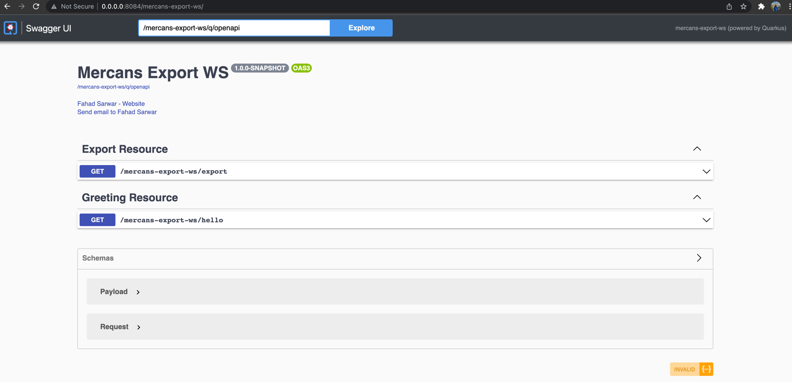
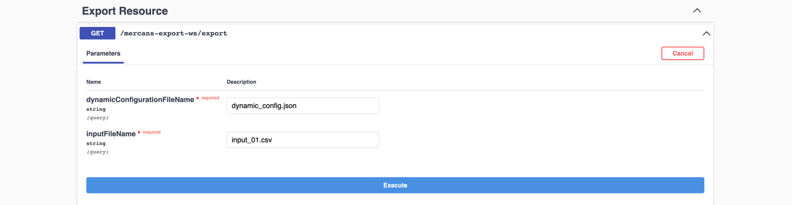
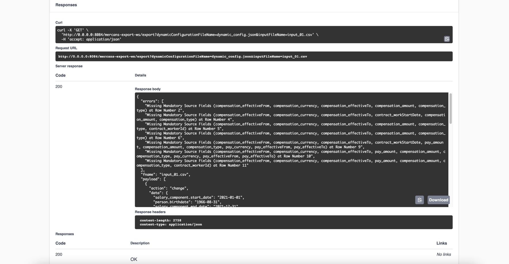

# mercans-export-ws Project

This project uses Quarkus, the Supersonic Subatomic Java Framework. If you want to learn more about Quarkus, please visit its website: https://quarkus.io/ .

## Packaging and running the application

The application can be packaged using:

```shell script
./mvnw clean install package -Dquarkus.package.type=uber-jar
```

The application, packaged as an _uber-jar_, is now runnable using `java -jar target/*-runner.jar`.

To access the application, open following URL in your web browser [mercans-export-ws](http://0.0.0.0:8084/mercans-export-ws/)



Access `/mercans-export-ws/export` API under `Export Resource` with following input parameters:

dynamicConfigurationFileName: `dynamic_non_mandatory_config.json` or `dynamic_config.json`
inputFileName: `input_01.csv`



Click on `Execute` to get the desired output as API response.



## Sample Output

### dynamic_non_mandatory_config.json

```json
{
  "errors": [
    "Unable to Parse Fields ({updte as Text}) at Row Number 5"
  ],
  "fname": "input_01.csv",
  "payload": [
    {
      "action": "hire",
      "data": {
        "salary_component.amount": 3300,
        "salary_component.end_date": "2022-01-31",
        "salary_component.start_date": "2022-01-01",
        "person.hire_date": "1992-07-01",
        "salary_component.currency": "USD",
        "person.birthdate": "1961-12-07",
        "person.gender": "M",
        "person.full_name": "Alberto Leonard"
      },
      "employeeCode": "611207BE",
      "payComponents": []
    },
    {
      "action": "change",
      "data": {
        "salary_component.amount": 500,
        "salary_component.currency": "EUR",
        "salary_component.end_date": "2021-12-31",
        "salary_component.start_date": "2021-01-01",
        "person.hire_date": "1998-09-06",
        "person.birthdate": "1966-08-31",
        "person.gender": "F",
        "person.full_name": "Hazel Webster"
      },
      "employeeCode": "660831F5",
      "payComponents": [
        {
          "amount": 500,
          "currency": "EUR",
          "startDate": "2021-01-01",
          "endDate": "2021-12-31"
        }
      ]
    },
    {
      "action": "change",
      "data": {
        "person.termination_date": "1999-09-06",
        "salary_component.amount": 4100,
        "salary_component.end_date": "2022-01-31",
        "salary_component.start_date": "2022-01-01",
        "salary_component.currency": "EUR",
        "person.birthdate": "1967-11-24",
        "person.gender": "F",
        "person.full_name": "Tara Maynard"
      },
      "employeeCode": "6711242C",
      "payComponents": []
    },
    {
      "action": "terminate",
      "data": {
        "person.termination_date": "2007-12-31",
        "salary_component.amount": 1500,
        "salary_component.end_date": "2022-01-31",
        "salary_component.start_date": "2022-01-01",
        "person.hire_date": "2007-07-18",
        "salary_component.currency": "EUR",
        "person.birthdate": "1978-05-04",
        "person.gender": "F"
      },
      "employeeCode": "7805046C",
      "payComponents": []
    },
    {
      "action": "hire",
      "data": {
        "salary_component.amount": 100,
        "salary_component.currency": "EUR",
        "salary_component.end_date": "2022-01-31",
        "salary_component.start_date": "2022-01-01",
        "person.hire_date": "2013-05-31",
        "person.birthdate": "1980-07-24",
        "person.gender": "M",
        "person.full_name": "Brock Salazar"
      },
      "employeeCode": "80072480",
      "payComponents": [
        {
          "amount": 100,
          "currency": "EUR",
          "startDate": "2022-01-01",
          "endDate": "2022-01-31"
        }
      ]
    },
    {
      "action": "change",
      "data": {
        "salary_component.amount": 50,
        "salary_component.currency": "EUR",
        "salary_component.end_date": "2022-07-01",
        "salary_component.start_date": "2022-01-01",
        "person.hire_date": "2015-05-31",
        "person.birthdate": "1990-04-05",
        "person.gender": "M",
        "person.full_name": "Cole Sloan"
      },
      "employeeCode": "90040543",
      "payComponents": [
        {
          "amount": 50,
          "currency": "EUR",
          "startDate": "2022-01-01",
          "endDate": "2022-07-01"
        }
      ]
    },
    {
      "action": "terminate",
      "data": {
        "person.birthdate": "1999-01-13",
        "person.termination_date": "2022-03-07"
      },
      "employeeCode": "2005055D",
      "payComponents": []
    },
    {
      "action": "hire",
      "data": {
        "person.hire_date": "2022-03-01",
        "person.birthdate": "2002-01-21",
        "person.full_name": "Zaiden Arnold"
      },
      "employeeCode": "020121F8",
      "payComponents": []
    },
    {
      "action": "hire",
      "data": {
        "salary_component.end_date": "2022-01-31",
        "salary_component.start_date": "2022-01-01",
        "person.hire_date": "2022-01-01",
        "salary_component.currency": "USD",
        "person.birthdate": "2003-03-19",
        "person.gender": "F",
        "person.full_name": "Norah Church"
      },
      "employeeCode": "22010199",
      "payComponents": []
    }
  ],
  "uuid": "6aee103e-d85b-47ca-9e11-f01f486a6899"
}
```

### dynamic_config.json

```json
{
  "errors": [
    "Missing Mandatory Source Fields (compensation_effectiveFrom, compensation_currency, compensation_effectiveTo, compensation_amount, compensation_type) at Row Number 2",
    "Missing Mandatory Source Fields (compensation_effectiveFrom, compensation_currency, compensation_effectiveTo, contract_workStartDate, compensation_amount, compensation_type) at Row Number 4",
    "Missing Mandatory Source Fields (compensation_effectiveFrom, compensation_currency, compensation_effectiveTo, compensation_amount, compensation_type, contract_workerId) at Row Number 5",
    "Missing Mandatory Source Fields (compensation_effectiveFrom, compensation_currency, compensation_effectiveTo, compensation_amount, compensation_type) at Row Number 6",
    "Missing Mandatory Source Fields (compensation_effectiveFrom, compensation_currency, compensation_effectiveTo, contract_workStartDate, pay_amount, compensation_amount, compensation_type, pay_currency, pay_effectiveFrom, pay_effectiveTo) at Row Number 9",
    "Missing Mandatory Source Fields (compensation_effectiveFrom, compensation_currency, compensation_effectiveTo, pay_amount, compensation_amount, compensation_type, pay_currency, pay_effectiveFrom, pay_effectiveTo) at Row Number 10",
    "Missing Mandatory Source Fields (compensation_effectiveFrom, compensation_currency, compensation_effectiveTo, pay_amount, compensation_amount, compensation_type, contract_workerId) at Row Number 11"
  ],
  "fname": "input_01.csv",
  "payload": [
    {
      "action": "change",
      "data": {
        "person.hire_date": "1998-09-06",
        "salary_component.amount": 500,
        "person.full_name": "Hazel Webster",
        "person.birthdate": "1966-08-31",
        "person.gender": "F",
        "salary_component.currency": "EUR",
        "salary_component.start_date": "2021-01-01",
        "salary_component.end_date": "2022-01-31"
      },
      "employeeCode": "660831F5",
      "payComponents": [
        {
          "amount": 500,
          "currency": "EUR",
          "startDate": "2021-01-01",
          "endDate": "2021-12-31"
        }
      ]
    },
    {
      "action": "hire",
      "data": {
        "person.hire_date": "2013-05-31",
        "salary_component.amount": 100,
        "person.full_name": "Brock Salazar",
        "person.birthdate": "1980-07-24",
        "person.gender": "M",
        "salary_component.currency": "EUR",
        "salary_component.start_date": "2022-01-01",
        "salary_component.end_date": "2022-01-31"
      },
      "employeeCode": "80072480",
      "payComponents": [
        {
          "amount": 100,
          "currency": "EUR",
          "startDate": "2022-01-01",
          "endDate": "2022-01-31"
        }
      ]
    },
    {
      "action": "change",
      "data": {
        "person.hire_date": "2015-05-31",
        "salary_component.amount": 50,
        "person.full_name": "Cole Sloan",
        "person.birthdate": "1990-04-05",
        "person.gender": "M",
        "salary_component.currency": "EUR",
        "salary_component.start_date": "2022-01-01",
        "salary_component.end_date": "2022-01-31"
      },
      "employeeCode": "90040543",
      "payComponents": [
        {
          "amount": 50,
          "currency": "EUR",
          "startDate": "2022-01-01",
          "endDate": "2022-07-01"
        }
      ]
    }
  ],
  "uuid": "1dfff1a6-a125-4529-8bd3-52eeab571c29"
}
```

## Related Guides

- REST Client ([guide](https://quarkus.io/guides/rest-client)): Call REST services
- Kotlin ([guide](https://quarkus.io/guides/kotlin)): Write your services in Kotlin
- YAML Configuration ([guide](https://quarkus.io/guides/config#yaml)): Use YAML to configure your Quarkus application
- RESTEasy JAX-RS ([guide](https://quarkus.io/guides/rest-json)): REST endpoint framework implementing JAX-RS and more

## Provided Code

### YAML Config

Configure your application with YAML
[Related guide section...](https://quarkus.io/guides/config-reference#configuration-examples)
The Quarkus application configuration is located in `src/main/resources/application.yml`.

### REST Client

Invoke different services through REST with JSON
[Related guide section...](https://quarkus.io/guides/rest-client)

### RESTEasy JAX-RS

Easily start your RESTful Web Services
[Related guide section...](https://quarkus.io/guides/getting-started#the-jax-rs-resources)
